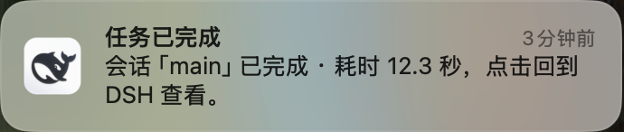
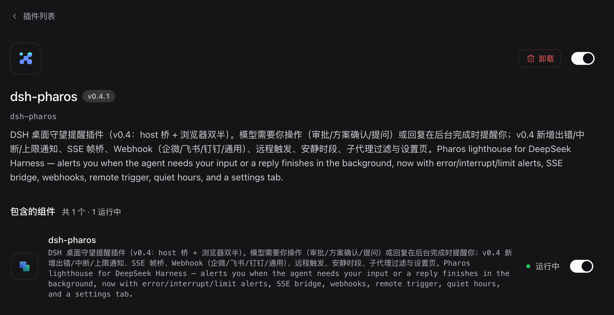
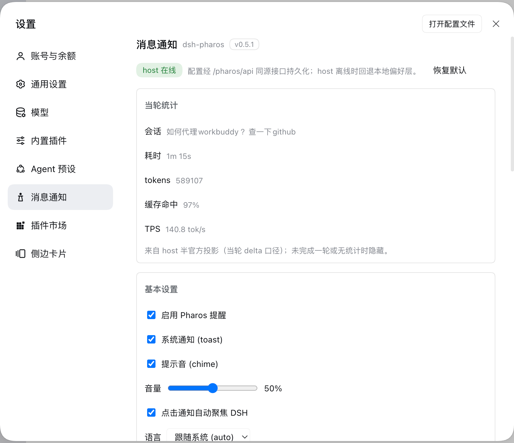
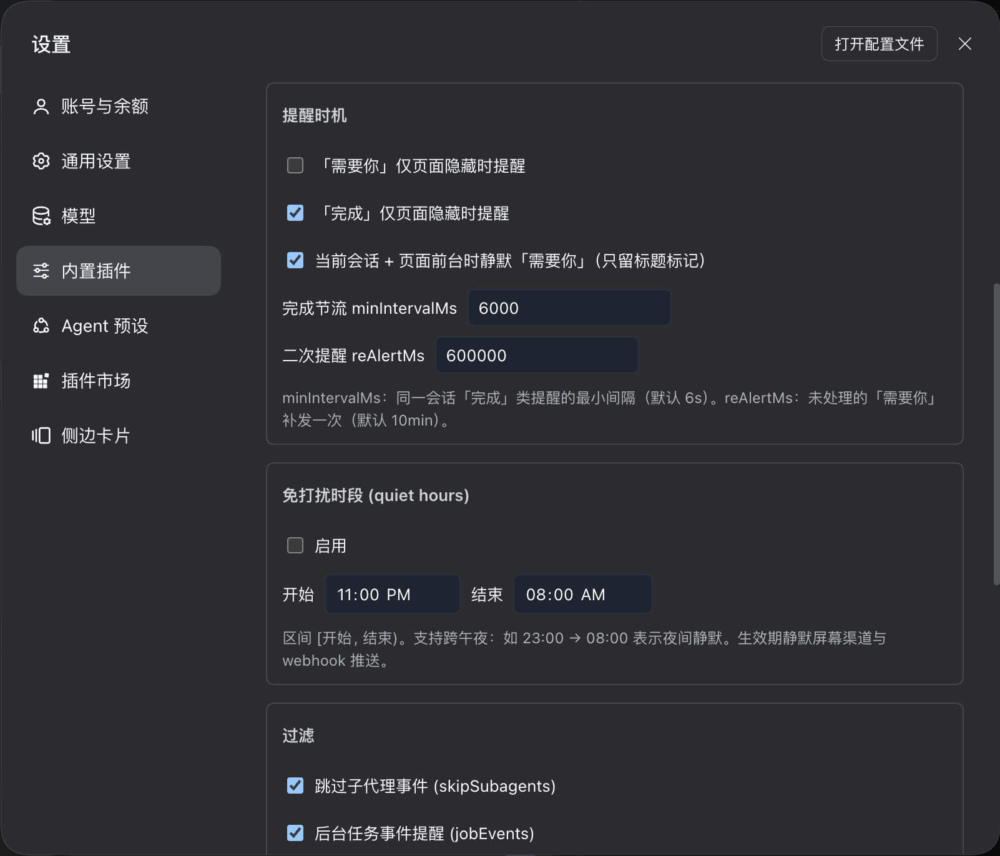
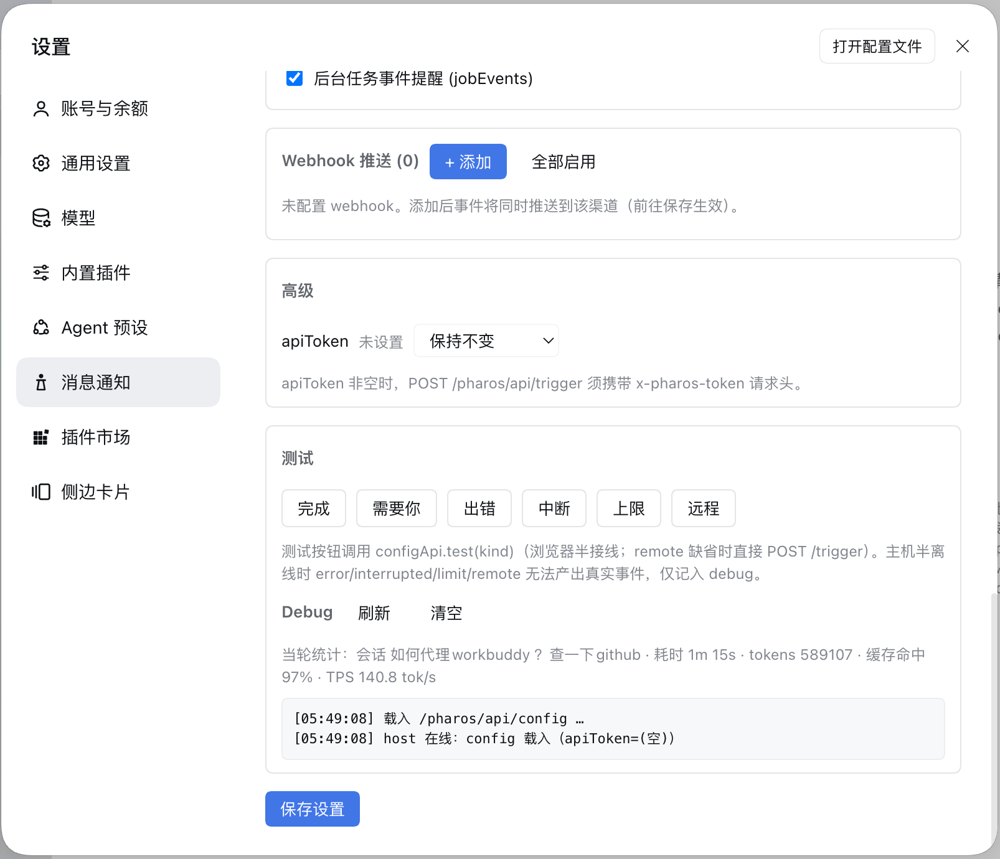

# dsh-pharos（法罗斯灯塔）

> 法罗斯灯塔（Pharos of Alexandria），世界七大奇迹之一，为夜航者引航。它在你离开 DSH 时替你守望：**任务完成、出错需要你知道、或是模型在等你操作**——灯塔亮起，把你唤回。

DSH 桌面端守望提醒插件：**「需要你操作」+「回复完成」+「运行出错 / 被中断 / 达到上限 / 后台任务」多路提醒** — 系统通知 + 分音型提示音 + 标题标记 + 可选的 Webhook 出站推送，专为"问完就切走、后台等结果"设计。能力对标社区四个同类插件（dsh-notify-me / dsh-turn-notify / dsh-my-notify / dsh-session-notify）中**浏览器半可实现**的部分，并为当前运行时（DSH 0.2.0-rc.2）原生实现：**零依赖、零 peer 声明**，无兼容性门槛。

## 提醒时机

| 时机 | 提醒内容 | 默认 |
| --- | --- | --- |
| 🔔 **需要你操作** — 审批请求 / 方案待确认（plan-review）/ 提问 | 系统通知 + 提示音 + 标题前缀 `🔔 需要你 · ` | 全时提醒；当前会话 + 页面在前台时**静默只留标题标记**（审批卡片本来就在眼前） |
| ⏳ **仍未处理** — 上面的待办 10 分钟没处理 | 补发一次系统通知 + 提示音，正文带「（仍未处理）」 | 每次请求至多补发一次，处理掉即撤销 |
| ✅ **回复完成** — 会话运行结束（含切走后完成的） | 系统通知 + 双音提示音 + **耗时小结**（「耗时 12 秒」）+ **当轮统计**（token 用量 / 缓存命中率 / TPS，v0.5 来自官方投影当轮 delta） | 仅页面隐藏/后台时提醒 |
| ❌ **运行出错** — agent 执行异常（`turn/end reason.kind=error`，`agent/error` 双轨兜底） | 系统通知 + **重低音三音** | 全时（v0.4，受 quiet hours / 过滤约束） |
| ✂️ **被中断 / ⛽ 达到上限** — interrupted / limit | 系统通知 + 中音警示 | 全时（v0.4） |
| 🛠️ **后台任务事件** — jobEvents（任务结束/移除） | 系统通知 | 默认开启，可关（v0.4） |

- **事件来源两条链路（v0.4 双半）**：浏览器半 `uiSession.sessionStatus`（需要你 / 回复完成，沿用 v0.3 语义）＋ host 半 **SSE**（`/pharos/api/stream`，`event: pharos` 命名帧：done / error / interrupted / limit / job / remote，内置 25s 心跳维持长连）——SSE 帧同时是 webhook 出站推送的事件源。
- **输出渠道**：系统通知 + 分音型提示音 + 标题标记/`⏳` 闪烁兜底（通知不可用时，6s）＋ **Webhook 出站推送**（可选：企微/飞书/钉钉加签 + 通用透传；5s 超时、指数退避重试、失败环形缓冲 50 条；受 quiet hours / events / 子代理过滤约束）。
- 点通知：窗口回前台，并尽力打开对应会话（best-effort）。
- 去重：SSE 帧级 2s 窗口 + **双源 done 去重**（SSE done 与 uiSession done 同会话只弹一次）+ 同会话节流（`minIntervalMs`，默认 6s）。
- 页面加载时已存在的待办补提醒一次；历史完成状态不补弹。
- 主开关关闭后：不弹通知、不响铃、不亮标记、不闪烁、不推 webhook。

## 效果示意











> 图为 macOS 本机真实截图：系统通知横幅来自实际「回复完成」事件；其余为设置页「内置插件 → 消息通知」标签的真实界面。

## 配置

v0.4 起：host 半在线时以服务端配置为准（`/pharos/api/config`，落盘 `<profile>/pharos.json`，设置页改）；host 不在线时回退浏览器偏好（`localStorage` 键 `dshPharos.config`），控制台实时生效：

设置页位于 **设置 → 插件 → dsh-pharos → 「消息通知」**（v0.4：React 渲染，`settings.plugins.tab` 槽位），覆盖全部配置项，另含：
- **当轮统计卡片**（v0.5）：展示最近一轮的耗时 / tokens / 缓存命中率 / TPS（host 官方投影当轮 delta；无统计时隐藏）
- **Webhook 渠道管理**：增删多渠道（企微/飞书/钉钉加签 + 通用透传），保存即生效
- **免打扰时段**（跨午夜）、**子代理过滤**、**apiToken** 管理（`***` 掩码=保留、`""`=清除）
- **一键测试按钮**：完成 / 需要你 / 出错 / 中断 / 上限 / 远程（走本地 deliver；`configApi` 缺失时远程类回退 `POST /trigger`）
- **Debug 面板**：配置来源 / host 在线状态 / SSE 状态与**帧计数** / 权限 / 绑定状态 / 实时日志（自动刷新、可清空）

```js
window.__dshPharos.config()           // 查看当前配置（含来源 configSource: 'server'|'local'）
window.__dshPharos.setConfig({
  enabled: true,               // 主开关（关闭 = 全渠道静默，含 webhook）
  toast: true,                 // 系统通知
  sound: true,                 // 提示音
  volume: 0.5,                 // 音量 0~1
  autoFocus: true,             // 点通知聚焦 DSH
  attentionHiddenOnly: false,  // 「需要你」仅页面隐藏时提醒
  doneHiddenOnly: true,        // 「回复完成」仅页面隐藏时提醒
  currentQuiet: true,          // 当前会话+前台：「需要你」静默只留标记
  minIntervalMs: 6000,         // 「完成」同会话节流（SSE 与 uiSession 双源共用）
  reAlertMs: 600000,           // 未处理的「需要你」10 分钟后补发一次
  blinkFallback: true,         // 通知不可用时的 ⏳ 标题闪烁兜底
  language: "auto",            // 'auto' | 'zh' | 'en'
  quietHours: { enabled: false, start: "23:00", end: "08:00" }, // 免打扰（跨午夜；静默屏幕渠道与 webhook）
  skipSubagents: true,         // 忽略子代理帧（host 半）
  jobEvents: true,             // 后台任务事件提醒（host 半）
  hostNotify: false,           // M1.5 预留：宿主原生 osascript 通知（本轮未实现）
  apiToken: "",                // 非空时 POST /pharos/api/trigger 须带 x-pharos-token 请求头
  webhooks: []                 // 出站 webhook 渠道配置（设置页管理）
})
window.__dshPharos.resetConfig()      // 恢复默认
window.__dshPharos.stats()            // 最近一轮当轮统计（{durationMs,tokens,cacheHitRate,tps,...}；无则 null）
window.__dshPharos.test("attention")  // 测试「需要你」
window.__dshPharos.test("done")       // 测试「回复完成」
window.__dshPharos.test("error")      // 测试「运行出错」（0.4；另支持 interrupted / limit / remote）
window.__dshPharos.test("done", { tokens: 240, cacheHitRate: 0.5, tps: 13.3 }) // 带可选统计参（v0.5）
window.__dshPharos.debug()
// 诊断要点：configSource（server=host 在线）/ sse（'open'|'connecting'|'error'）/
// framesReceived + lastFrameAt（SSE 帧计数——sse:'open' 但 framesReceived 恒 0 = 通道未通的可判定信号）
```

## 安装

通过公开 GitHub 仓库一键安装（零构建、零依赖，**仓库根即插件包**）：

- **npm（发布后可用，推荐）**：`dsh plugin add dsh-pharos` —— npm 包为预构建产物，免 `allowBuilds` 授权，一条命令装好
- **桌面端**：打开 DSH → 插件市场（dshmarket）→ 安装/添加 → 粘贴 GitHub 仓库地址（`github:Leo-Cjw/dsh-pharos` 或完整 URL）→ 安装 → **重启 DeepSeek Harness**
- **CLI（GitHub 源）**：`dsh plugin add github:Leo-Cjw/dsh-pharos`（具体语法以 `dsh plugin --help` 为准）

**本机开发安装**（改本地代码直接生效，无需发布）：

```bash
# ① 把仓库同步到 profile 的 local-plugins（源码地）
cp -R <repo>/ ~/.dsh/profiles/desktop/local-plugins/dsh-pharos
# ② 登记进 profile manifest（dependencies + bundles；link: 保持指向 local-plugins）
#    "dependencies": { ..., "dsh-pharos": "link:./local-plugins/dsh-pharos" }
#    "dsh.profile.bundles": [ ..., "dsh-pharos" ]
# ③ 物化 node_modules 链接（供应链年龄策略对本地 link 不适用，绕过校验即可）
pnpm install --dir ~/.dsh/profiles/desktop --config.minimumReleaseAge=0
# ④ 确认链接存在，然后重启 DeepSeek Harness
ls -la ~/.dsh/profiles/desktop/node_modules/dsh-pharos   # → ../local-plugins/dsh-pharos
```

> 注意：profile 的 node_modules 由插件管理器在启动时用 pnpm 重建，**不在 dependencies 里的包会被清掉**——这就是「装完重启后插件消失」的原因。务必走 ②③ 的登记流程。

仓库结构（即安装后的布局）：

```
package.json        # dsh.bundle.patch + dsh.client 声明（browser 半，platform: web）
cordis.patch.yml    # 自挂载 loader 行（id/name: dsh-pharos）
lib/index.js        # host 半入口（apply → host.js：事件桥/SSE/Webhook/配置）
lib/host.js         # host 半组装（订阅/帧总线/出口过滤）；lib/host/* 为模块
lib/client.js       # browser 半（全部逻辑 + 内联设置页；零 npm 运行时依赖）
lib/settings-view.js# 设置页规范源（内联进 client.js，改后运行 tools/sync-settings-view.mjs）
```

重启后在控制台验证：`window.__dshPharos.test("done")`。

## 开发

从 GitHub 克隆本仓库开发（`git clone git@github.com:Leo-Cjw/dsh-pharos.git && cd dsh-pharos`，零依赖、无需安装）。

- 冒烟测试：`node test/smoke.mjs`（Node ≥ 18；驱动真实 `lib/client.js`；v0.3 全量断言 + v0.4 M1 组：SSE 帧消费 / 双源 done 去重 / quiet hours / 子代理过滤 / toast 兜底 / 服务端配置优先 / test() 扩展 / **SSE 命名事件契约锁**——client 注册的事件名须与 host 写出的一致，防两侧漂移回归）；host 半：`node test/host.test.mjs`（130 项：事件映射 / SSH・webhook / 鉴权 / 配置打码合并 / quiet hours / 帧去重）
- 发布流程：改 `lib/` 与 `package.json` → `node tools/sync-settings-view.mjs`（设置页视图内联进 client.js，`npm test` 前会自动执行）→ 跑测试 → 升版本 → `npm publish` → `git push` → 在 DSH 插件市场 / CLI 更新安装 → 重启后控制台 `window.__dshPharos.test("attention"|"done"|"error")` 验证
- 架构文档：[functional-architecture.md](https://github.com/Leo-Cjw/dsh-pharos/blob/main/docs/functional-architecture.md)（功能架构雏形：运行时能力核查 + 四仓库对标 + M0/M1/M2 里程碑）
- 架构图：[pharos-architecture.html](https://github.com/Leo-Cjw/dsh-pharos/blob/main/docs/diagrams/pharos-architecture.html)（浏览器半 × Host 半双层结构）· [pharos-sequence.html](https://github.com/Leo-Cjw/dsh-pharos/blob/main/docs/diagrams/pharos-sequence.html)（通知事件流）——浏览器打开即交互（主题切换/聚焦/导出）
- 对标仓库代码级分析：[docs/research/](https://github.com/Leo-Cjw/dsh-pharos/tree/main/docs/research)（notify-me / turn-notify / my-notify / session-notify 逐文件报告）

## 工作原理

双半结构（v0.4）：

- **浏览器半**（`lib/client.js`）订阅客户端 `sessions` 服务（硬依赖，本运行时必有）与 `ctx.uiSession`（惰性 `ctx.get()`，避免 inject 硬门控导致条目停在 pending）：
  - `uiSession.sessionStatus` 每会话发布 `{ running, pendingInteraction, completionUnread }`，「需要你」与「回复完成」沿用 v0.3 语义（二次提醒/标题标记/闪烁兜底不变）。
  - v0.4 新增对 host 半事件流的消费：`EventSource('/pharos/api/stream')`（`event: pharos` 命名事件，帧 JSON）收 PharosEvent 帧，与本地 `uiSession` 信号共用同一策略层（quiet hours / 子代理过滤 / 双源 done 去重 / 通知渠道路由）；系统通知不可用时页内 toast 兜底（上限 4 条、6s 消失、点击直达会话）。`debug()` 的 `framesReceived` 一栏可直接判定「通道已通」还是「连上但零帧」。
  - 设置页视图（`lib/settings-view.js`，内联于 bundle）挂 `settings.plugins.tab`。
- **host 半**（`lib/index.js` + `lib/host/*`，Electron 主进程）：
  - 订阅 `session/event`（`turn/end` 的 `reason.kind` 主信号 → done/error/interrupted/limit，`agent/error` / `agent/turn-stopping` / `agent/request-error` / `jobs` 双轨兜底），构造 PharosEvent 帧。
  - `ctx.webServer.register`（同源路由，无独立端口）：`GET /pharos/api/stream`（SSE，25s 心跳）/ `POST /pharos/api/trigger`（远程触发，loopback 围栏 + `x-pharos-token`）/ `GET|PUT /pharos/api/config`（掩码语义 `***`=保留、`""`=清除）/ `GET /pharos/api/webhooks`。
  - 出站 webhook：企微/飞书/钉钉加签 + 通用透传；5s 超时、指数退避重试、失败环形缓冲 50 条；受 quiet hours / events / 子代理过滤约束。

## 对标社区插件：做到了什么 / 没做什么

| 对标项 | 来源 | 本插件 |
| --- | --- | --- |
| 需要你操作（审批/提问/方案确认）+ 标题标记 | dsh-notify-me | ✅ |
| 已完成提醒（仅离开时）| dsh-notify-me / dsh-turn-notify | ✅ |
| 未处理二次提醒 | dsh-turn-notify（10 分钟）| ✅ |
| 通知不可用时标题闪烁兜底 | dsh-turn-notify | ✅（⏳，6s）|
| 耗时小结 | dsh-turn-notify / dsh-session-notify | ✅（客户端计时；token/TPS 需 host 侧数据，未做）|
| 点击通知直达会话 | dsh-notify-me / dsh-my-notify | ✅（best-effort）|
| 设置页（设置→消息通知）| dsh-turn-notify / dsh-my-notify | ✅ v0.4（`settings.plugins.tab` 槽位，React 经模块表 `require('react')`）|
| 多事件分类（出错/被中断/达到上限）+ 独立音效 | dsh-turn-notify | ✅ v0.4（host 半 `session/event` reason.kind 归一定类 → SSE 帧；error 重低音、interrupted/limit 中音警示）|
| 出站 webhook（企微/飞书/钉钉/通用 + 加签/重试/失败缓冲）| dsh-my-notify | ✅ v0.4（host 半 `/pharos/api/stream` 双通道之一）|
| 远程触发接口（本机 POST 通知）| dsh-my-notify | ✅ v0.4（`POST /pharos/api/trigger`，loopback 围栏 + 可选 `x-pharos-token`）|
| Windows 原生推送 + 自定义图片 | dsh-session-notify | N/A（macOS 平台）|

## 已知限制

- 双半方案：DSH 页面需保持打开（最小化/切后台可以；退出应用收不到）；host 半需挂载在同一 DSH（webServer 同源）。浏览器半在 host 不在线时自动回落 v0.3 行为（仅 needs-you / done）。
- Electron 页面通知需允许 DeepSeek Harness 的系统通知权限（macOS：系统设置 → 通知）。
- 首次页面加载后的第一声需要页面上有过一次用户交互（浏览器自动播放策略）。
- 出错/被中断/达到上限依赖 reason.kind 在 `turn/end` 上的出现（0.2.0-rc.2 已见 interrupted/forked；更全的 kind 集合随运行时演进，未知 kind 静默降级由 `agent/error` 等兜底）。
- 当轮统计（缓存命中率/TPS）依赖 host 半的官方投影 `ctx.sessionProjections`（`tokenUsage`/`sessionStats`）；投影不可用或插件中途启用（无 turn/start 基线）时静默降级为「仅耗时+tokens」，不报错。
- 点通知"打开对应会话"为 best-effort（`sessions.binding(id)?.session.open()`），失败时仅聚焦窗口。
- 宿主原生 osascript 通知（`hostNotify`）为 M1.5 预留，本轮未实现；webhook 需自行配置渠道（企微/飞书/钉钉机器人）。

## License

MIT